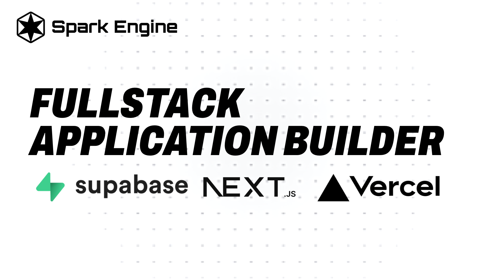

# Fullstack Next.js Builder

[](https://github.com/spark-engine-ai)
[](https://github.com/spark-engine-opensource-projects)
[](https://discord.gg/VAQA5c32jM)

## Overview

Next.js Builder is a robust and intuitive application designed to streamline the process of creating and managing web applications built with Next.js. This tool empowers users to generate pages, APIs, and database schemas interactively through a multi-step interface. Additionally, it seamlessly integrates with a backend deployment server to automatically deploy projects to Vercel and manage databases using Supabase.

## Table of Contents

- [Prerequisites](#prerequisites)
- [Installation](#installation)
- [Usage](#usage)
- [Environment Variables](#environment-variables)
- [Deployment Workflow](#deployment-workflow)
- [Important Notes](#important-notes)
- [License](#license)
- [Related Links](#related-links)

## Prerequisites

Before using this application, ensure you have the following prerequisites installed and configured:

- **Node.js** (v14.x or higher) and npm/yarn.
- Accounts with [Vercel](https://vercel.com/) and [Supabase](https://supabase.com/).
- A [ngrok](https://ngrok.com/) account for tunneling (for the deployment server).
- A **Spark API Key** which you can obtain by signing up at [Spark Engine](https://sparkengine.ai) and navigating to `Account > API Keys`.

## Installation

To set up the project, follow these steps:

1. **Clone the Repository:**

    ```bash
    git clone https://github.com/spark-engine-opensource-projects/Fullstack-NextJs-WebApp-Generator.git
    cd Fullstack-NextJs-WebApp-Generator
    ```

2. **Install Dependencies:**

    ```bash
    npm install
    # or
    yarn install
    ```

3. **Deploy the Application to Vercel:**

    **Note:** The Next.js Builder application must be deployed on Vercel to function correctly. Follow these steps to deploy it:

    - Install the Vercel CLI:
      ```bash
      npm install -g vercel
      ```

    - Log in to Vercel:
      ```bash
      vercel login
      ```

    - Deploy the application:
      ```bash
      vercel --prod
      ```

    After deployment, ensure you update the `NGROK_DEPLOYER_URL` in your Vercel configuration with the URL provided by ngrok (as described in the [Important Notes](#important-notes) section below).

4. **Set Up Environment Variables:**

    Navigate to your created project in Vercel and configure the following environment variables:

    ```bash
    SPARK_API_KEY=your-spark-api-key
    NGROK_DEPLOYER_URL=your-ngrok-deployer-url
    ```

## Usage

### Project Creation

1. **Start a New Project:** Use the multi-step form to enter your project's details, including its name, type (single or multiple pages), colors, logos, and purpose.
   
2. **Generate Pages and Components:** Define the pages and their components. Customize the styling as needed.

3. **Create and Manage APIs:** Automatically generate and manage serverless APIs based on your project’s specifications.

4. **Define Database Schema:** Review and modify the database schema generated by the application to ensure it aligns with your project requirements.

### Deployment

Once your project is ready, you can deploy it directly using the integrated deployment server. The server manages the deployment process, integrates with Vercel, and handles environment variables and database setup on Supabase.

### Environment Variables

- **SPARK_API_KEY:** Your Spark API key for code generation.
- **NGROK_DEPLOYER_URL:** The URL of the deployment server managed via ngrok.

Ensure these variables are set in Vercel for the application to function correctly.

### Deployment Workflow

1. **Create and Customize Your Project:** Follow the step-by-step process in the application to create and customize your Next.js project.
2. **Deploy Using the Backend Server:** Once the project is ready, use the `/deploy` endpoint of the backend server to deploy the project to Vercel and manage the Supabase database. The backend server handles the deployment process, including managing environment variables and executing SQL scripts.
3. **Monitor and Update:** Use the application’s dashboard to monitor and update your project as needed, with options to regenerate components and redeploy.

## Important Notes

1. **Cloning the Backend Deployment Server:**
   If you want to automatically deploy your projects to Vercel and manage databases with Supabase, you will need to clone and set up the backend deployment server. Follow these steps:

   - Clone the Backend Deployment Server Repository:
   
     ```bash
     git clone https://github.com/spark-engine-opensource-projects/Automated-NextJS-deployer-to-vercel-and-supabase.git
     cd Automated-NextJS-deployer-to-vercel-and-supabase
     ```

   - **Set Up and Start the Server:**
     Follow the instructions in the backend server's README to install dependencies, set environment variables, and start the server.

   - **Update the NGROK_DEPLOYER_URL:**
     Once the backend server is running and ngrok is tunneling, update the `NGROK_DEPLOYER_URL` in your Next.js Builder Vercel configuration with the URL provided by ngrok.

2. **Deployment Requirement for Frontend Next.js Builder:**
   The frontend Next.js Builder application must be deployed to Vercel to function properly. This is because the application relies on Vercel's infrastructure for dynamic API generation and hosting. Follow the deployment instructions provided above to ensure the application is correctly hosted.

## License

This project is licensed under the MIT License. See the [LICENSE](./LICENSE) file for details.

## Related Links

- **Original GitHub Repository:** [Spark Engine AI](https://github.com/spark-engine-ai)
- **Explore Spark Engine Projects:** [Spark Engine Projects](https://sparkengine.ai/search)

[](https://sparkengine.ai/search)